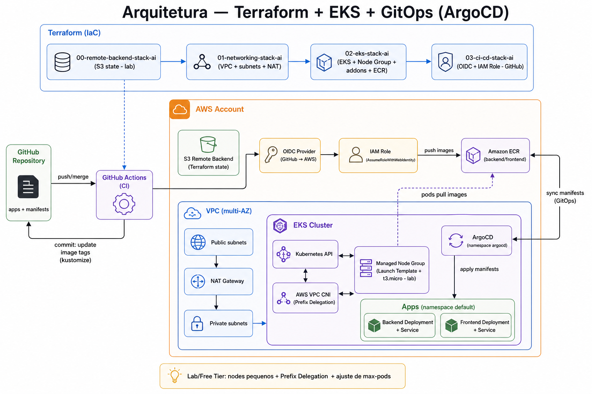
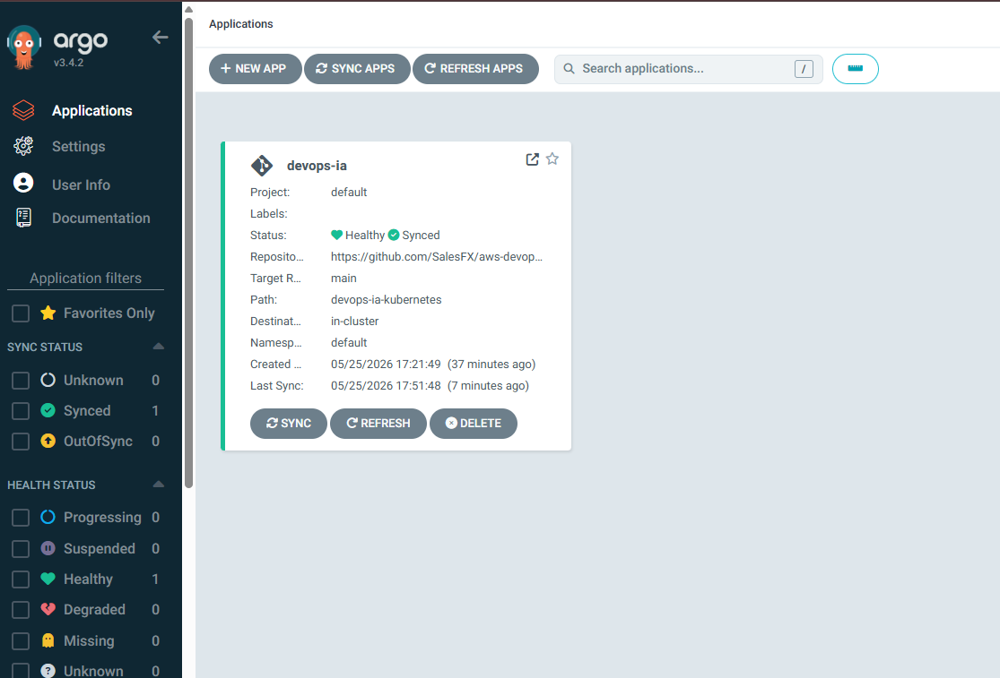
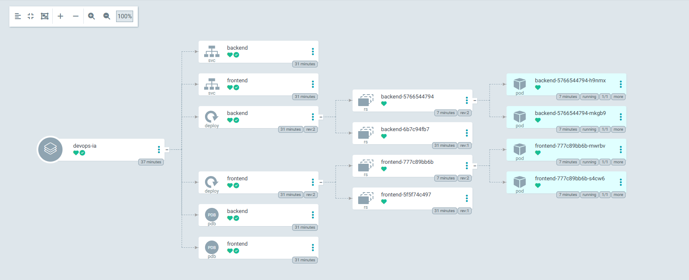
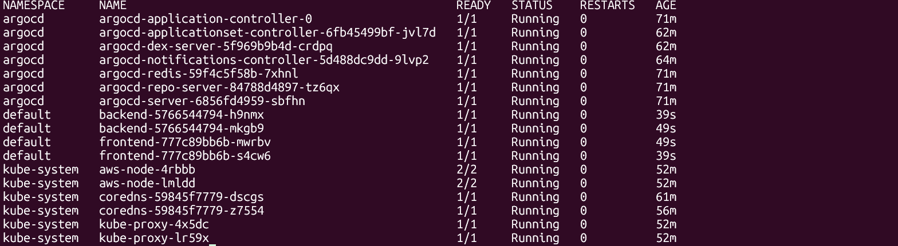
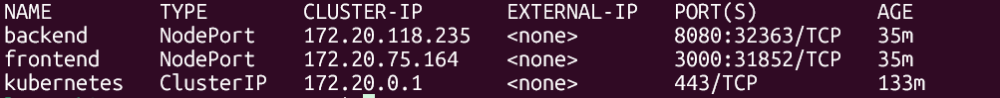
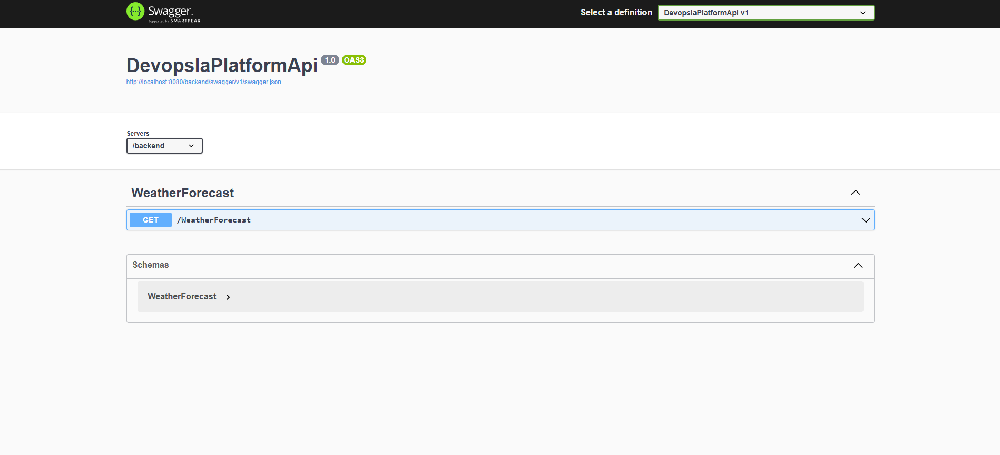
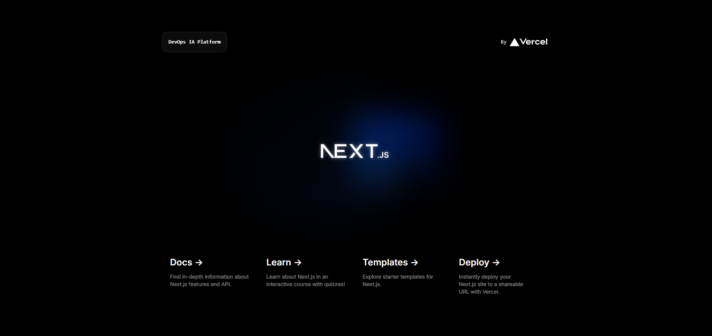
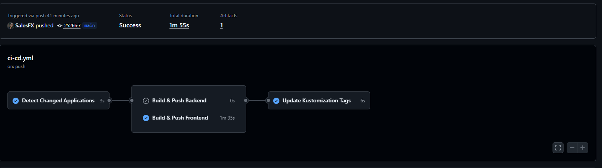

# AWS DevOps Platform — EKS + GitOps (ArgoCD) + Terraform

Ambiente de estudo/portfólio que provisiona uma stack completa na AWS (rede + EKS + CI/CD) e entrega aplicações no Kubernetes usando GitOps com ArgoCD.

## O que este projeto entrega (visão geral)

- **Infra as Code (Terraform)**:
  - Backend remoto (S3) para state (stack `00-remote-backend-stack-ai`);
  - Rede (VPC multi-AZ, subnets públicas/privadas, NAT, Flow Logs) (stack `01-networking-stack-ai`);
  - Cluster **EKS** + Node Group + Add-ons + ECR (stack `02-eks-stack-ai`);
  - **OIDC + IAM Role** para GitHub Actions publicar imagens no ECR sem credenciais fixas (stack `03-ci-cd-stack-ai`).
- **Aplicações (apps)**:
  - Backend **.NET** (API) com `Dockerfile`;
  - Frontend **Next.js** com `Dockerfile`.
- **Kubernetes (manifests)**:
  - Deployments/Services/PDBs para backend e frontend (via `kustomize`);
  - **ArgoCD Application** para sincronizar o repositório (bootstrap manual).
- **CI/CD (GitHub Actions)**:
  - Build/push de imagens (backend e frontend) para ECR;
  - Atualização automática de tags no `kustomization.yaml` (GitOps pattern).

## Stack/tecnologias utilizadas

- AWS: VPC, EKS, ECR, IAM, OIDC Provider
- Terraform
- Kubernetes + Kustomize
- ArgoCD (GitOps CD)
- GitHub Actions (CI)
- Apps: .NET (backend) e Next.js (frontend)

## Estrutura do repositório

- `devops-ia-terraform/`
  - `00-remote-backend-stack-ai/` — S3 para state (laboratório)
  - `01-networking-stack-ai/` — VPC + subnets + NAT + flow logs
  - `02-eks-stack-ai/` — EKS + node groups + addons + ECR
  - `03-ci-cd-stack-ai/` — OIDC + IAM Role/policies para GitHub Actions
- `devops-ia-kubernetes/`
  - `kustomization.yaml` — base GitOps (imagens/tags e resources)
  - `backend/` e `frontend/` — manifests (Deployment/Service/PDB)
  - `argocd-application.yaml` — Application do ArgoCD (bootstrap)
- `devops-ia-apps/`
  - `backend/DevopsIaPlatformApi/` — API .NET + `Dockerfile`
  - `frontend/devops-ia-platform/` — Next.js + `Dockerfile`
- `docs/` — ADRs e registros de implementação (decisões e justificativas)

## Pré-requisitos

- AWS CLI configurada (perfil/credenciais)
- Terraform instalado
- `kubectl` instalado
- (Opcional) `argocd` CLI
- Permissões na AWS para criar os recursos (VPC/EKS/ECR/IAM/S3)

## Passo a passo (do zero ao deploy via GitOps)

### 0) Ajustes iniciais

1. Confira variáveis e valores de ambiente em:
   - `devops-ia-terraform/**/envs/production.tfvars`
2. Valide se o `.gitignore` está respeitando arquivos locais do Terraform (ver seção “Terraform State”).

### 1) (Opcional, recomendado) Backend remoto do Terraform (state)

Objetivo: armazenar o state fora da máquina local (padrão profissional).

```bash
cd devops-ia-terraform/00-remote-backend-stack-ai
terraform init
terraform plan -var-file="envs/production.tfvars"
terraform apply -var-file="envs/production.tfvars"
```

Depois, configure os demais stacks para apontarem para o backend remoto (S3 + lock) conforme seu padrão/organização.

### 2) Provisionar rede (VPC)

```bash
cd devops-ia-terraform/01-networking-stack-ai
terraform init
terraform plan -var-file="envs/production.tfvars"
terraform apply -var-file="envs/production.tfvars"
```

### 3) Provisionar EKS + ECR

```bash
cd devops-ia-terraform/02-eks-stack-ai
terraform init
terraform plan -var-file="envs/production.tfvars"
terraform apply -var-file="envs/production.tfvars"
```

Configure o `kubectl`:

```bash
aws eks update-kubeconfig --name devops-ia-production --region us-east-1
kubectl get nodes
```

### 4) Instalar ArgoCD (bootstrap manual)

O `argocd-application.yaml` é aplicado **uma única vez** (bootstrap). Ele não fica dentro do `kustomization.yaml` para evitar um loop de “ArgoCD gerenciando seu próprio Application” (o que pode causar deleções/recriações indesejadas).

```bash
kubectl create namespace argocd
kubectl apply -n argocd -f \
  https://raw.githubusercontent.com/argoproj/argo-cd/v2.14.11/manifests/install.yaml

kubectl wait --for=condition=Ready pods --all -n argocd --timeout=300s

kubectl apply -f devops-ia-kubernetes/argocd-application.yaml
```

Acesso local (UI):

```bash
kubectl -n argocd get secret argocd-initial-admin-secret \
  -o jsonpath="{.data.password}" | base64 -d

kubectl port-forward svc/argocd-server -n argocd 8080:443
```

### 5) Habilitar CI/CD com GitHub Actions (OIDC → ECR)

Provisione OIDC e IAM Role para o GitHub Actions:

```bash
cd devops-ia-terraform/03-ci-cd-stack-ai
terraform init
terraform plan -var-file="envs/production.tfvars"
terraform apply -var-file="envs/production.tfvars"
```

No GitHub do repositório, crie a variável (não é segredo) em:
`Settings → Secrets and variables → Actions → Variables`

- Nome: `AWS_ROLE_ARN`
- Valor: ARN da role criada (output do Terraform)

O workflow fica em `/.github/workflows/ci-cd.yml` e:
- builda/pusha imagens para ECR quando houver mudanças em `devops-ia-apps/`;
- atualiza as tags no `devops-ia-kubernetes/kustomization.yaml`;
- o ArgoCD sincroniza e aplica no cluster.

### 6) Primeiro deploy (validação ponta a ponta)

1. Faça um commit alterando backend ou frontend em `devops-ia-apps/`;
2. Confirme a execução do workflow no GitHub Actions;
3. Valide se o `kustomization.yaml` foi atualizado com novas tags;
4. Valide no ArgoCD (UI) o sync e rollout no cluster.

## Observações sobre este ambiente (lab/free tier)

Este projeto foi criado como ambiente de estudo/portfólio usando créditos AWS/Free Tier.

Por esse motivo, o cluster EKS utiliza instâncias pequenas, como `t3.micro`, para reduzir custo. Esse tipo de instância possui limitação baixa de pods por node devido ao limite de ENIs/IPs da AWS.

Para permitir a execução de workloads como ArgoCD, foi habilitado:

- Prefix Delegation no AWS VPC CNI;
- Launch Template customizado no Node Group;
- bootstrap customizado do kubelet com `--use-max-pods false`;
- ajuste de `--max-pods=110`.

Essa configuração é aceitável para laboratório, estudo e demonstração técnica, mas não representa necessariamente a configuração ideal para produção.

## Como seria em produção

Em produção, a recomendação seria:

- usar instâncias maiores e adequadas ao workload;
- definir `requests` e `limits` de CPU/memória;
- usar Cluster Autoscaler ou Karpenter;
- separar node groups por tipo de workload;
- usar múltiplas AZs;
- configurar monitoramento com Prometheus/Grafana/CloudWatch;
- controlar acesso via IAM Roles/OIDC;
- usar backend remoto para Terraform com lock;
- evitar credenciais fixas, preferindo OIDC no GitHub Actions;
- aplicar políticas de segurança, network policies e revisão de permissões IAM.

O uso de `t3.micro` neste projeto é uma escolha consciente para reduzir custo em ambiente de estudo.

## Terraform State

O state do Terraform não deve ser versionado no Git.

Arquivos como estes devem permanecer fora do repositório:

- `.terraform/`
- `*.tfstate`
- `*.tfstate.*`
- `terraform.tfvars`

Em ambiente real, o state deve ser armazenado em backend remoto, como S3 com lock habilitado.

## Decisões de arquitetura (ADRs)

As decisões e justificativas do projeto estão documentadas em `docs/`:

- `docs/ADR-0001-networking-stack-vpc-multi-az.md`
- `docs/ADR-0002-remote-backend.md`
- `docs/ADR-0003-eks-cluster.md`
- `docs/ADR-0004-oidc-provider-iam-roles-github-aws.md`
- `docs/ADR-0005-pipeline-github-actions-ci-cd.md`
- `docs/ADR-0006-argocd-gitops-deployment.md`

## Arquitetura (diagrama + screenshots)

- Diagrama (fonte Mermaid): `docs/architecture/architecture.mmd`
- Diagrama (PNG): `docs/architecture/architecture.png`
- Sugestão de screenshots (cole aqui e referencie no README):
  - `docs/architecture/screenshots/argocd-ui.png`
  - `docs/architecture/screenshots/kubectl-get-pods.png`
  - `docs/architecture/screenshots/kubectl-get-svc.png`



### Como ler o diagrama

- **GitHub Repository (apps + manifests)**: código em `devops-ia-apps/` e manifests em `devops-ia-kubernetes/`.
- **GitHub Actions (CI)**: ao fazer `push/merge`, o workflow em `.github/workflows/ci-cd.yml` executa build e publicação.
- **OIDC Provider → IAM Role**: o Actions autentica na AWS via OIDC e assume uma role com credenciais temporárias (stack `devops-ia-terraform/03-ci-cd-stack-ai/`).
- **Amazon ECR**: o Actions faz **push** das imagens no ECR (repositórios criados no stack `devops-ia-terraform/02-eks-stack-ai/`).
- **Commit atualizando tags (kustomize)**: o pipeline atualiza `devops-ia-kubernetes/kustomization.yaml` com as novas tags e commita no repositório (padrão GitOps).
- **ArgoCD**: sincroniza os manifests do Git e aplica no cluster via Kubernetes API.
- **Managed Node Group (Launch Template + t3.micro lab)**: nodes do EKS executam os workloads; aqui ficam os ajustes de laboratório (Prefix Delegation/max-pods).
- **Pull de imagens (pods/nodes → ECR)**: quem puxa as imagens do ECR são os nodes/pods quando os Deployments são aplicados/atualizados (o ArgoCD não “puxa imagem”, ele aplica manifests).

### Evidências (ambiente rodando)

#### ArgoCD (GitOps)





#### Workloads (Kubernetes)









#### CI/CD


